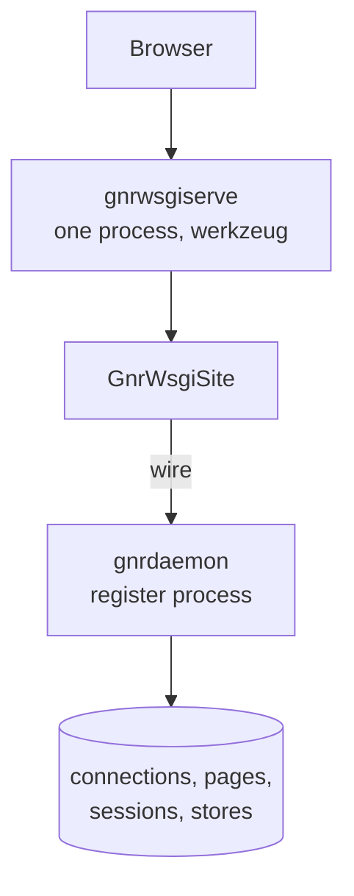
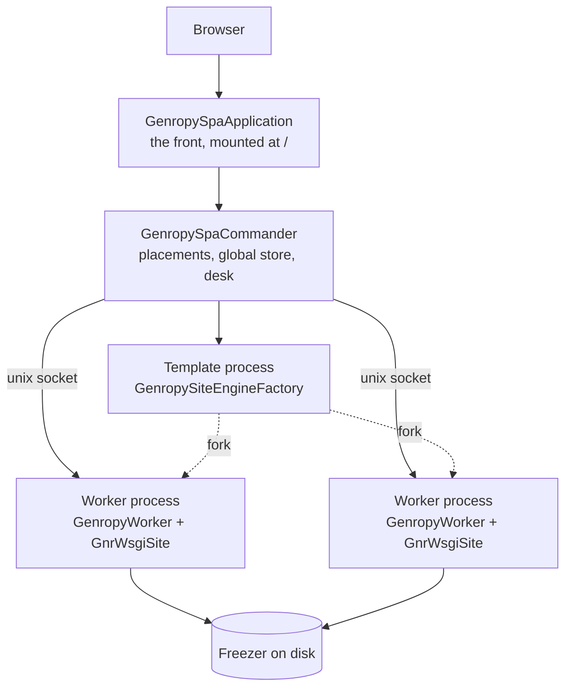
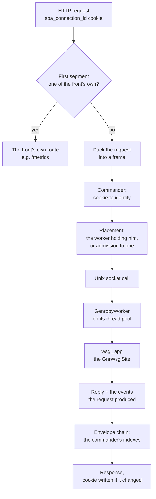
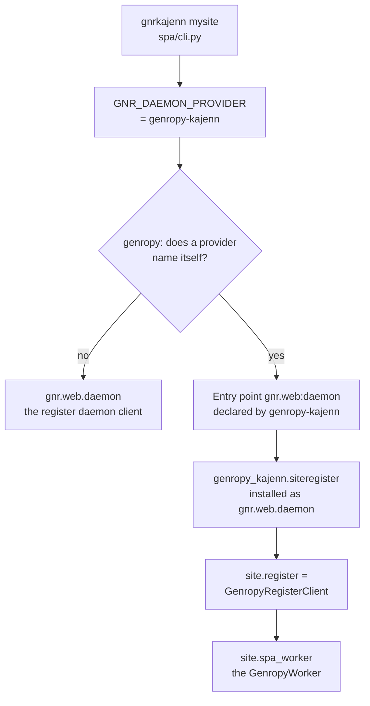

# Architecture overview

Four pictures of the same machine: what the legacy stack puts on a host and what
this one puts there instead, how one page request travels, how genropy comes to
resolve its register to this package, and how a change reaches the pages that
must see it.

Each diagram is followed by the classes that do the work, named with their
module. Everything lives in `genropy_kajenn` unless the text says otherwise;
`kajenn_orchestra` and `kajenn` are the two distributions underneath.

(a-topology)=
## The topology, before and after

The legacy stack runs the site in one process and the register in another. The
browser reaches the site, the site reaches the daemon, and growing past one
process means an external balancer and shared session state.



genropy-kajenn puts the front and the commander in one server process and the
sites in worker processes, each with its register inside it. The template
process exists only to fork workers; the freezer is a directory tree on disk.



`GenropySpaApplication` (`spa/genropy_spa_application.py`) is mounted by the
recipe in `spa/config.py` and is a subclass of `SpaApplication`
(`kajenn_orchestra.spa_app`). Its `commander_class` is `GenropySpaCommander`
(`spa/genropy_spa_commander.py`), a subclass of `SpaCommander`
(`kajenn_orchestra.orchestration`). The recipe declares one group, named `pool`,
whose `worker_class` is `genropy_kajenn.spa.genropy_worker:GenropyWorker` and
whose `engine_factory` is
`genropy_kajenn.spa.site_engine_factory:GenropySiteEngineFactory`. That factory
is what makes the template process worth having: `build_group_engine()` builds
the `GnrWsgiSite`, touches `resources_dirs` and `storage("gnr")` so the lazy
resolutions are paid once for the whole group, and calls
`site.db.closeConnection()` so no child inherits an open database socket.
Everything that supervises those processes — the group handler, the worker
handlers, the connectors, the freezer — belongs to kajenn-orchestra.

(b-request)=
## The life of a page request

A request for a site path is not routed by the front: it is packed whole and
walked to the worker that holds the user.



The two-stage demux and the forwarding are `SpaApplication`'s, in
kajenn-orchestra: the first path segment selects an internal root, and anything
else is packed and handed to the commander, which resolves the
`spa_connection_id` cookie (`SPA_CONNECTION_ID_COOKIE` in
`kajenn_orchestra.spa_app`) to an identity and a worker. `GenropySpaApplication`
adds one native route of its own, `metrics`, and the root mount.

In the worker the core's http call form reaches `self.wsgi_app`, which
`GenropyWorker.__init__` assigned: the `GnrWsgiSite` itself, or that site wrapped
in `GnrDebuggedApplication` when `debugger` is set. The site runs synchronously
on the worker's thread pool. While it runs it calls `site.register` — which is
`GenropyRegisterClient` — and that object calls the worker's own methods
directly, in the same process.

On the way back, what the request produced travels with the reply. Page births
carry their `table_subscriptions`, which
`GenropyCommanderEnvelopeHandler.on_new_page` hands to
`record_page_table_subscriptions`, so the desk's index is a projection of the
page rows and is rebuilt from every announcement.

(c-provider)=
## How genropy resolves the daemon provider

The legacy imports `gnr.web.daemon`. Which module answers is decided per process,
by an environment variable, before the site machinery is imported.



`cmd_serve` in `spa/cli.py` writes the variable with
`os.environ.setdefault("GNR_DAEMON_PROVIDER", DAEMON_PROVIDER)`, where
`DAEMON_PROVIDER` is the string `"genropy-kajenn"`. `pyproject.toml` declares the
entry point under `[project.entry-points."gnr.web"]` as
`daemon = "genropy_kajenn.siteregister"`. Once installed under that name, the
legacy imports resolve here: `gnr.web.daemon.siteregister_client` gives
`SiteRegisterClient`, which `siteregister/__init__.py` exports as an alias of
`GenropyRegisterClient`, and `gnr.web.daemon.siteregister` gives
`DEFAULT_PAGE_MAX_AGE` and `GnrDaemonException` from
`siteregister/siteregister.py`.

`GenropyWorker.__init__` builds the client eagerly — `self._register_client =
self._gnr_site.register` — because the site's lazy `register` property does
database work that must not run on the event loop, and assigns
`site.spa_worker = self`, which is how the client reaches the worker's verbs.

(d-delivery)=
## How a change reaches the pages that want it

Three species travel, and the desk on the commander is where the ones that cross
a process boundary are filed.

```mermaid
flowchart TD
    commit["A request commits<br/>on worker A"] --> notify["notifyDbEvents<br/>filter on subscribed_tables"]
    notify --> slot["GenropyRequestSlot<br/>deposits of this request"]
    write["An addressed write"] --> local{"target page:<br/>same user, this worker?"}
    local -->|"yes"| row["The page's own row queue"]
    local -->|"no"| call["CALL /commander/delivery/on_datachange"]
    slot --> endreq["End of request:<br/>exchange or deposit"]
    endreq --> desk["DeliveryDesk<br/>on the commander"]
    call --> desk
    desk --> queues[("Per-page queues,<br/>per-user store queue")]
    queues --> collect["collect_page<br/>on the subscriber's next request"]
    desk --> push["subscribed_tables<br/>pushed to every worker"]
    push --> notify
```

`notifyDbEvents` (`spa/genropy_worker.py`) shapes one deposit per table through
`dbevent_deposit` and lays them on `GenropyRequestSlot`. It filters at the
source: a table absent from `self.subscribed_tables`, or a batch that is empty,
is not announced at all. That filter set is fed by exactly one thing — the order
`/commander/delivery/subscribed_tables`, served by `DeliveryOrders` in the same
module — which `GenropySpaCommander.broadcast_subscribed_tables` pushes on every
transition of the global set, and `on_worker_presented` pushes to a worker that
has just been born.

The slot has two exits, both at the end of the request: the exchange inside
`collect_page`, which files what this request produced and takes back what waits
for its page in one round, or `deliver_slot_deposits`, which sends the deposits
up alone when no page collected.

An addressed write does not wait for the end of the request. `set_datachange`
routes it: a page of the caller's own user living in this worker takes it on its
row at once; anything else climbs immediately on
`/commander/delivery/on_datachange`, so a request that never collects loses
nothing and the answer says whether the target exists at all.

`DeliveryDesk` (`spa/delivery_desk.py`) holds the subscription index
(`SubscriptionIndex`, `spa/subscription_index.py`, both directions in one object)
and three queues: `page_datachange_map`, `page_dbevent_map` and
`user_store_change_map`. Nothing waiting there expires — a queue lives as long as
its page, and `drop_page` is what empties it — and nothing is pushed from the
desk to a browser: a page collects on its own next request.

:::{admonition} Under review
:class: warning

The queues are deliberately outside the pickled surface: what waits for a user
who goes into the freezer is lost with the websockets that would have carried it.
The module says so, and no page here claims otherwise. What a browser observes
when that happens has not been written down, and this documentation does not
describe it.
:::

## Source map

| Concern | Module |
| --- | --- |
| The front, the root mount, `/metrics` | `spa/genropy_spa_application.py` |
| The commander and the envelope layer | `spa/genropy_spa_commander.py` |
| The desk: subscriptions and queues | `spa/delivery_desk.py` |
| The subscription index, both directions | `spa/subscription_index.py` |
| The worker, its verbs and its request slot | `spa/genropy_worker.py` |
| The page row and the registry | `spa/genropy_register.py` |
| The legacy Bag capture and the `BAG` wire type | `spa/legacy_bag.py` |
| The one construction of the `GnrWsgiSite` | `spa/site_engine_factory.py` |
| The launch recipe | `spa/config.py` |
| The command | `spa/cli.py` |
| The in-process register | `siteregister/siteregister_client.py` |
| The global store on the commander | `siteregister/global_store_adapter.py` |
| The names the legacy imports | `siteregister/siteregister.py`, `handler.py`, `service.py`, `processes.py` |
| A genropy database behind REST and MCP | `proxy/genropy_proxy.py` |
