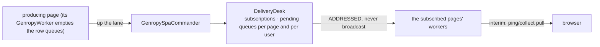

# Datachanges distribution

**Version**: 0.2 · **Last Updated**: 2026-09-04 · **Status**: 🔴 DA REVISIONARE

Moved in from kajenn `internals/20_spa/050_datachanges/*` with #59 (2026-09-04):
the mechanism is the bridge's now, attached to the core through the seams the
core names (`internals/20_spa/080_bridge-contract/design.md`).

**The need.** What one page changes, the other pages that care must see —
without every page polling the world.

How a change produced on one page reaches the pages that must see it: a page's
queue empties on the worker, delivery is ADDRESSED through the `DeliveryDesk`
(`spa/delivery_desk.py`, the `delivery` branch of the commander's dispatcher) —
never broadcast, never per-worker snapshots.

**Where a page's own changes are queued.** The page register row
(`GenropyPageRow`, `spa/genropy_register.py`) carries `datachanges` and
`datachanges_idx`. `GenropyRegistry.subscribe_page_store` attaches to the row's
legacy Bag a subscriber under the id `page_store:<register_item_id>`: every
update, insert and delete whose path falls under a prefix in
`page["subscribed_paths"]` is appended to `datachanges` with
`key.reason == "serverChange"`, autocreated parents skipped, prefixes matched
segment-aware. `GenropyWorker.collect_page` empties the queue and resets the
index. The queue is a row field, so it travels in the parcel through a freeze
and a transfer. Every access to a row and to its Bag takes the row's exclusive
re-entrant `item_lock`. The user store keeps its `user_view` — another round
(D-DC3 rethinks it).

**Where an addressed change goes.** `set_datachange`, `reset_datachanges` and
`drop_datachanges` name a target. A target page of the CALLER'S OWN user living
on this worker is served on the spot: `GenropyRegistry.append_page_datachange`
appends the change to that row under its `item_lock` and stamps the next
`datachanges_idx`, so the addressed write and the `serverChange` subscriber share
one list and one index. The same user is the condition because his freeze waits
for the caller's own pending call. Any other address — a page of another user
even on this worker, `filters`, the STATE kinds — leaves at once from the request
thread as one CALL to `/commander/delivery/on_datachange`, filed the moment the
verb runs; the desk judges existence and a target nobody holds comes back as
`filed: False` in the verb's answer — reported, never raised, as the daemon's
silent return on a missing item; a `user_store` write that went nowhere is
logged at warning level by the worker, with the user and the path. Every queued
change carries `arrival_ts`, the wall-clock instant it joined its queue (row or
desk), and `collect_page` merges the row's list with what the desk hands back on
that stamp — arrival order, the order one list would have had — with the
writer's own `change_ts` untouched; nothing waiting expires, the queue dies with
the page.

Interactions: dbevents (same desk) · global-store (the core's) · orchestration
(the lane carries them).

## The delivery

The last hop is the provisional one: the final design pushes over websocket.

## Decisions

Final design (owner, 2026-08-20): datachanges reach the browser PUSHED over
websocket; the pull via collect is an interim vehicle.

## Open frictions

- Delivery to the browser currently rides the ping/collect pull; declared
  provisional and possibly imperfect.
- A `user_store` write in the same request as the login reaches the desk before
  the login event does (events ride the REPLY): `filed: False`, the write is
  lost and logged. Serving it locally on the worker that hosts the user is
  D-DC3's — see `temp/note_per_kajenn_59.md`.

## Current state

What exists today on `feat/8-genropy-machinery-in`: everything above, exercised
by `tests/test_page_store_row.py`, `tests/test_data_plane.py`,
`tests/test_request_exchange.py`, `tests/test_verb_refusal.py`,
`tests/test_carried_store_views.py` and `tests/test_delivery_desk.py` on the live
lane of `tests/lane.py`.
