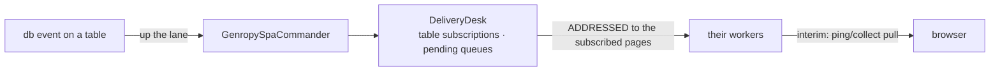

# Table subscriptions and dbevents

**Version**: 0.3 · **Last Updated**: 2026-09-04 · **Status**: 🔴 DA REVISIONARE

Moved in from kajenn `internals/20_spa/060_dbevents/*` with #59 (2026-09-04):
the mechanism is the bridge's now, attached to the core through the seams the
core names (`internals/20_spa/080_bridge-contract/design.md`).

**The need.** A page shows a table; when the database changes that table, the
page must learn it — even if the writer was a batch or another user.

A page subscribes to tables; a database event is delivered to the subscribed
pages through the `DeliveryDesk` (`spa/delivery_desk.py`): the subscription
index (`SubscriptionIndex`, `spa/subscription_index.py`, both directions in one
object) and the pending queues per page.

Interactions: datachanges (same desk) · orchestration (mobility must not lose a
pending event).

## The delivery

Nothing waiting at the desk expires: a queue lives as long as its page, and
`drop_page` is what empties it. A page that leaves for the freezer takes
nothing with it: what waited for it is lost with the websockets that would
have carried it.

## Where the index lives, and how it follows the rows

`GenropyWorker.subscribeTable` moves the row's `table_subscriptions` and files
the interest at the desk with a synchronous CALL on
`/commander/delivery/subscribe_table`: when the request goes on to commit, the
index is already right. The row's set travels in the parcel and is replayed on
the woken row; the `new_page` announcement carries it
(`GenropyPageRow.announcement_fields`) and the bridge's envelope layer
(`GenropyCommanderEnvelopeHandler.on_new_page`) hands it to
`GenropySpaCommander.record_page_table_subscriptions` — the index is a
projection of the page rows, rebuilt from every birth and every wake.

## How a worker knows the subscribed tables, and when it delivers

The worker filters the commits of its site with its own `subscribed_tables`,
which only the commander writes: on every transition of the global set — the
first subscriber of a table, the last one gone — `broadcast_subscribed_tables`
pushes the whole set to every living worker through the order
`/commander/delivery/subscribed_tables` (`DeliveryOrders` on the worker's
`commander_orders`), and a newborn worker receives it at its presentation
(`GenropySpaCommander.on_worker_presented`). No reply of `subscribe_table` or
`exchange` carries a table list.

The deposits of a request (`notifyDbEvents`, shaped once by `dbevent_deposit`,
filtered at the source) accumulate on the request's own slot
(`GenropyRequestSlot.dbevents`) and leave the worker in two ways. `collect_page`
carries them to the desk in its exchange (`/commander/delivery/exchange`) and
retires that page's queues. What the collect did not carry — a `rootPage`
webhook, a request that failed after its commit — is sent up
`/commander/delivery/deposit` at the end of every request
(`on_request_served` → `deliver_slot_deposits`), which files the deposits in the
subscribers' queues and retires nothing: there is no page to answer. The
`local_only` deposits of the hidden transaction (`own_dbevents`) never leave the
process: they reach the origin page's own collect alone.

## Open frictions

- Same interim transport as datachanges: pull via ping/collect, push over
  websocket is the final design.

## Current state

What exists today on `feat/8-genropy-machinery-in`: everything above, exercised
by `tests/test_dbevents.py`, `tests/test_slot_deposit.py`,
`tests/test_subscribed_tables_broadcast.py`, `tests/test_desk_projection.py`,
`tests/test_delivery_desk.py` and `tests/test_subscription_index.py`.
